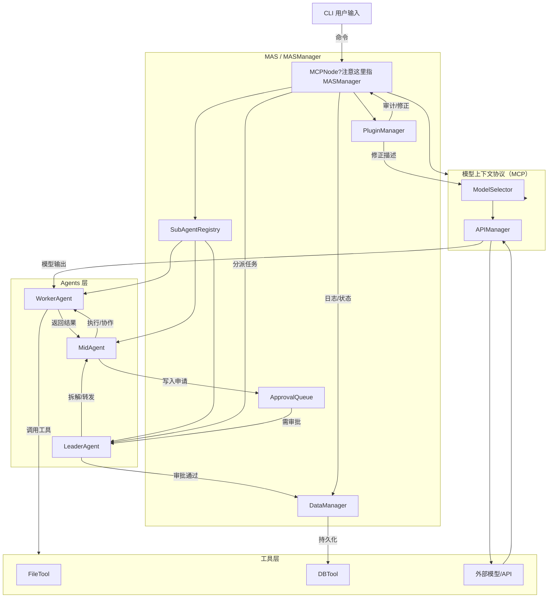

# 多智能体C++系统结构与实现框架说明

## 一、项目目录结构

```
/your_project_root/
├── CMakeLists.txt                     # 构建或VS工程文件
├── README.md
├── config/
│   ├── api_config.json                # API、模型、并发、Token等配置
│   ├── permissions.json               # 权限/审批/串门规则配置
│   └── agent_matrix.json              # agent间互访关系等
├── src/
│   ├── cli/
│   │   └── main.cpp                   # 命令行主入口
│   │   └── CliCommandParser.h/.cpp
│   ├── mas/
│   │   ├── MASManager.h/.cpp          # 多Agent中央调度/权限/审批/组队/日志（MAS）
│   ├── agents/
│   │   ├── IAgent.h
│   │   ├── LeaderAgent.h/.cpp
│   │   ├── MidAgent.h/.cpp
│   │   ├── WorkerAgent.h/.cpp
│   │   └── SubAgentRegistry.h/.cpp    # agent发现与组队
│   ├── api/
│   │   ├── APIManager.h/.cpp
│   │   └── ModelSelector.h/.cpp
│   ├── tools/
│   │   ├── ITool.h
│   │   ├── FileTool.h/.cpp
│   │   ├── DBTool.h/.cpp
│   │   └── ...
│   ├── db/
│   │   ├── DataManager.h/.cpp
│   │   ├── ApprovalQueue.h/.cpp
│   │   └── LogManager.h/.cpp
│   ├── common/
│   │   ├── Task.h/.cpp
│   │   └── Utility.h/.cpp
├── test/
│   └── test_scenarios.cpp
└── doc/
    ├── system_flow.png
    └── agent_collaboration.md
```

---

## 二、整体架构/流程

- 所有CLI命令，优先交给MASManager调度。
- MASManager负责权限、Agent调度、模型/API分配、审批流、组队和日志（整体系统称为 MAS）。
- Agent分为三层：Leader/Mid/Worker，均通过注册中心（SubAgentRegistry）动态发现、协同、串门。

注：文中 "MCP" 指 "模型上下文协议（Model Context Protocol）"，它是一个独立的组件/服务，用于模型上下文管理、模型选择与API并发/调度等职责。MCP 与 MAS 通过接口（RPC/HTTP/消息队列等）交互，但 MCP 不是 MAS 的插件，文档中已将其从 MAS 内部逻辑分离并单独说明。

## 三、实现要点与机制

### 1. MAS（中央调度与整体）

- `MASManager`负责 agent 注册、权限校验、任务路由、审批流和组队。MAS 作为整体负责多智能体协作与资源调度。

> 注意：涉及模型选择、模型并发限制与模型上下文管理的部分由独立的 MCP 组件负责（见下文），MAS 通过接口调用 MCP 提供的能力，而不是把 MCP 当作 MAS 的插件。

### 2. Agent三层分工与注册
- 所有agent必须实现`IAgent`接口，支持标准的“接收任务-调用工具-交互-回传结果”。
- LeaderAgent负责最后审批写入、全局分派；MidAgent可执行或串接任务但核心写入需审批；WorkerAgent执行具体工具调用。
- 所有agent通过`SubAgentRegistry`注册和发现，支持临时组队（自由协作），实现agent间“串门”。
- 权限、可见/可协作关系由`agent_matrix.json`配置。

### 3. 工具与API管理
- 工具全部接口化，如`ITool`、`IDBTool`，支持热插拔、自动权限分派。
- `APIManager`管理所有模型API的可用与并发数限制，所有请求必须调度后下发。注意：API 管理与模型选择功能的实现可以由 MCP 提供，MAS 可以委托 MCP 做最终的模型/API选型和并发控制。
- `ModelSelector`支持按任务内容动态选用最优模型（如gpt-4o/3.5等）。该模块的策略与上下文管理建议放在 MCP 侧实现，从而让 MAS 专注于多 Agent 协作与审批流。

### 4. 数据审批与日志
- `DataManager`与`ApprovalQueue`组合管理正式和临时写入，所有需审批的数据先入排队，获得Leader批复后正式持久化。
- `LogManager`全链路记录任务、审批、Agent协作（debug和回溯用）。

### 5. 配置与热扩展
- 全部行为规则、权限关系、模型API、插件启用等，均通过config下json进行集中维护，即改即用无需重编译。
- 插件拓展能力和Agent注册也可支持动态(进阶可上DLL、so方案或直接源码静态链接）。

---

## 四、开发和部署建议

1. **目录搭起后，逐步落每个目录的基类/核心流程接口**，如IAgent、ITool等。
2. **先实现MAS、Agent、Tools之间调用主流程**，可用模拟数据或mock工具实现通过“命令-路由-审批-写入-日志”的完整最小链路（能跑起来为准）。
3. **逐步替换Mock为真实API和工具实现**，并增加测试覆盖常见串门、组队、超限等场景。
4. 测试建议直接写在test/目录下，细分任务流、审批边界、多agent协作等用例。

---

## 五、常见开发注意事项

- 并发管理务必用互斥锁、条件变量防数据竞争。
- 所有任务与审批请求建议用唯一ID（可用UUID库）。
- 插件API、配置格式定期review；建议写接口注释，以方便扩展者参考。
- 推荐用VS2022/VS Code+cmake，文件与依赖见CMakeLists.txt，严格按src/目录组织源码，便于多人协作。
- 日志与出错处理先保证信息全，后期再做细粒度异常和自动修复。
- 需求变化/新插件建议写清文档，在doc/目录补结构说明/变更集。

---

## 六、FAQ

- **如何加新agent或工具？**  
  实现IAgent/ITool接口后，在SubAgentRegistry/DataManager等地注册，配置agent_matrix.json分配权限即可。
- **模型API速率或额度怎么配？**  
  直接改config/api_config.json，自定义最大并发、token池等。MCP 可作为一个集中管理模型速率与上下文分配的服务，从而让 MAS 无需直接管理模型池。

---

## 工作流程（Mermaid）

下面是系统典型工作流程图（Mermaid 格式）。把这段放到文档里可以在支持 mermaid 的渲染器里直接看到流程图。



---
